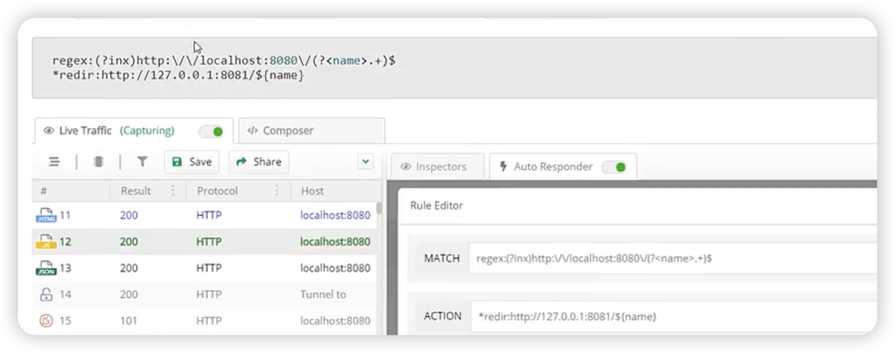

webpack 模块联邦探究
怎么调试代码？
测试环境 
 webpack 配置
 ```js
  devtool:false, // 借助插件
 plugins: [
       ...
        // 通过插件，自己生成sourceMap
        // SourceMapDevToolPlugin 是一个内置插件，可以更加精细控制sourcemap的生成
        new webpack.SourceMapDevToolPlugin({
            filename: '[file].map[query]', // 文件名 query 是查询参数
            // append: '\n//# sourceMappingURL=http://127.0.0.1:8081/[url]' // 在构建文末尾处生成 url 是文件地址
            append: false //在main 文件末尾里不会生成url
        }),
        // 当发布测试环境时，会将dist文件发布，但是不想将map文件发布环境，可以配置一下代码，将map文件复制到指定文件，删除dist 文件下的目录；
        new FileManagerWebpackPlugin({
            events: {
                onEnd: {// 构建结束后
                    copy: [
                        {
                            source: './dist/*.map', // 拷贝的源文件
                            destination: path.resolve('./sourcemaps') // 复制到指定文件目录
                        }
                    ],
                    delete: ['./dist/*.map'] // 删除dist文件下 map文件

                }
            }
        })
    ]
 ```
生成一个soureces 文件 通过http-server -c -1 -p 8081 启动，拿到http://127.0.0.1:8081/xx.js.map文件
在控制台 对应文件下 添加源文件【这个方法设计手动关联源文件， 实现代码调试】

生产环境调试定位代码方式
```js
 devtool:'hidden-source-map', 
 plugins: [
       ...
        // 通过插件，自己生成sourceMap
        // SourceMapDevToolPlugin 是一个内置插件，可以更加精细控制sourcemap的生成
        new webpack.SourceMapDevToolPlugin({
            filename: '[file].map[query]', // 文件名 query 是查询参数
            // append: '\n//# sourceMappingURL=http://127.0.0.1:8081/[url]' // 在构建文末尾处生成 url 是文件地址
            append: false //在main 文件末尾里不会生成url
        }),
        // 当发布测试环境时，会将dist文件发布，但是不想将map文件发布环境，可以配置一下代码，将map文件复制到指定文件，删除dist 文件下的目录；
        new FileManagerWebpackPlugin({
            events: {
                onEnd: {// 构建结束后
                    copy: [
                        {
                            source: './dist/*.map', // 拷贝的源文件
                            destination: path.resolve('./sourcemaps') // 复制到指定文件目录
                        }
                    ],
                    delete: ['./dist/*.map'] // 删除dist文件下 map文件

                }
            }
        })
    ]
```
 方式1： 手动关联 缺点：如果文件较多，需要手动关联文件就多

 方式2: 自动关联  代理工具fiddler 